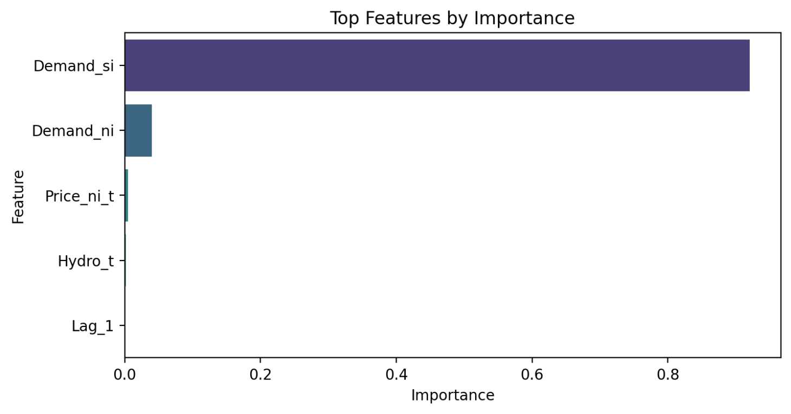
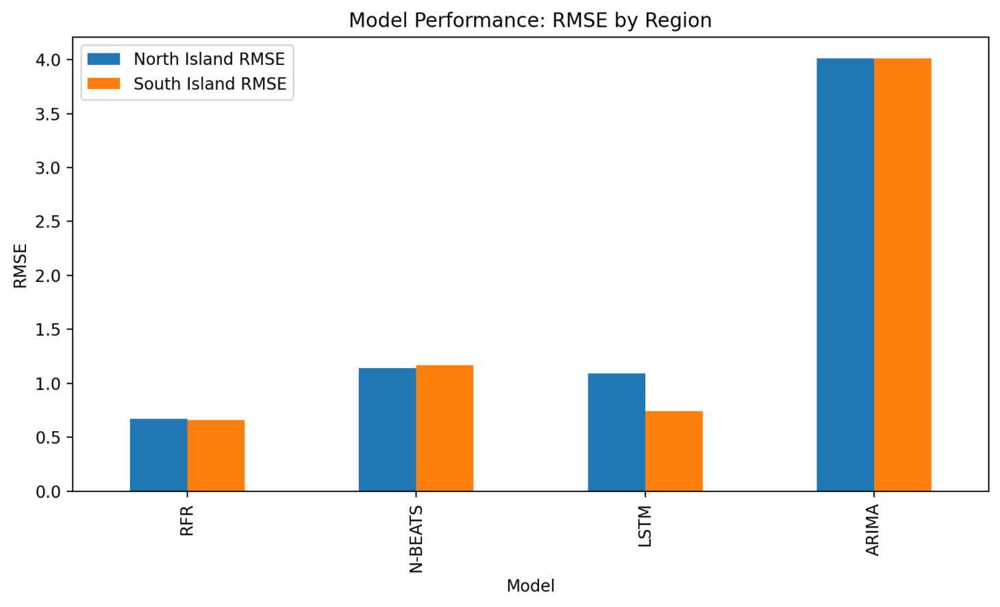
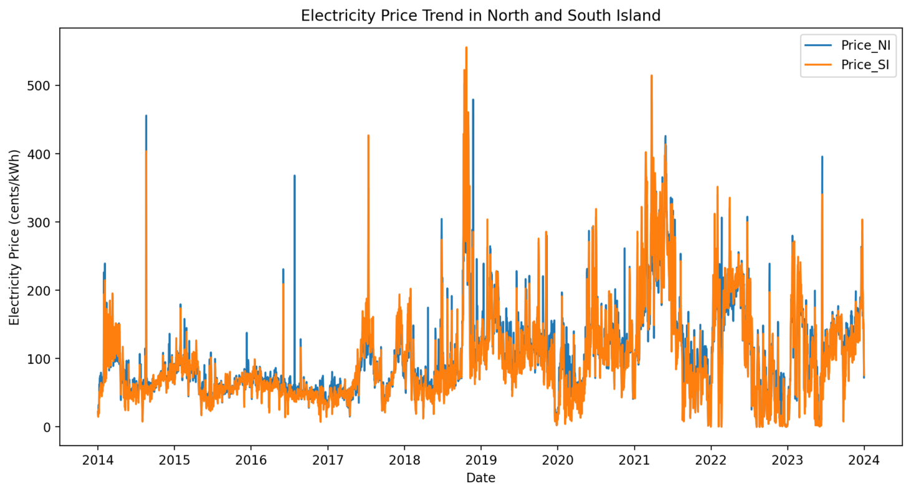

# 🔋 Forecasting New Zealand Electricity Prices

This project investigates the impact of renewable energy on electricity prices in New Zealand and compares various forecasting models. Using daily data from 2014 to 2023, we explore how hydro, wind, and wood energy affect short- and long-term price trends in the North and South Islands.

## 📌 Project Objectives

- Analyze the relationship between electricity prices and renewable energy sources.
- Apply feature selection techniques like Random Forest and Granger causality.
- Compare forecasting models: LSTM, N-BEATS, ARIMA, and Random Forest Regressor.
- Evaluate performance under univariate vs. multivariate setups.

## 🗃️ Data

- **Source**: Daily electricity market data (2014–2023) including:
  - Electricity prices (North/South Islands)
  - Renewable generation (Hydro, Wind, Wood)
  - Electricity demand, reserves, forward prices
  - HVDC transmission between islands
- **Preprocessing**:
  - Box-Cox and Yeo-Johnson transformations
  - Standardization
  - STL decomposition (seasonality, trend, residual)

## 🧠 Models Used

- **Random Forest Regressor (RFR)**
- **N-BEATS** (Neural basis expansion model for time series)
- **LSTM** (Long Short-Term Memory)
- **ARIMA** (Autoregressive Integrated Moving Average)

## ⚙️ Feature Selection

- **Random Forest Feature Importance**
- **Granger Causality Test** (without lags)
- **STL-based decomposition** (seasonal/trend components)

*Figure: Random Forest feature importance ranking.*

## 📊 Results Summary

*Figure: Comparison of model RMSE on 1-year test set.*

| Model | Best RMSE (NI) | Best RMSE (SI) |
|-------|----------------|----------------|
| LSTM (importance score) | 0.53 (1-yr) | 0.47 (1-yr) |
| RFR (importance score)  | 0.65 (1-yr) | 0.63 (1-yr) |
| ARIMA (univariate)      | 4.01        | 4.01        |

> LSTM outperformed other models in short-term forecasting, particularly when using selected features based on importance scores.

## 📁 Project Structure

- 📂 data/ # Cleaned and transformed dataset
- 📂 figures/ # STL plots, model results
- 📂 notebooks/ # Jupyter Notebooks with EDA and modeling
- 📂 models/ # Trained models (optional)
- 📄 Client_Report.pdf # Final project report
- 📄 README.md # Project documentation

## 📈 Electricity Price and Hydro Trend

*Figure: Daily electricity prices and hydropower generation trend (2014–2023).*

## 🔍 Key Insights

- **Hydropower** shows the strongest seasonal and trend influence on electricity prices.
- **Electricity demand** is the most important predictor (based on feature importance scores).
- **LSTM** is the best performer for short-term predictions; **Granger causality** helps in long-term settings.

## 📌 Limitations

- No solar energy or weather data included.
- Policy and external market factors are excluded.
- Complexity of models increases with many lag terms (90 lags added).

## 🔮 Future Work

- Integrate solar data, weather, and policy variables.
- Explore hybrid ensemble models.
- Apply anomaly detection for extreme price events.

## 🧑‍💻 Author

**Yuxin Lang**  
Supervisor: Dr. Shu Su / Dr. Nuttanan Wichitaksorn  
STAT995 Project — University of Auckland
